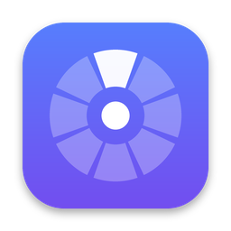

  
  <h1>Pop</h1>
  
<strong>Hold right click. Flick. Done.</strong>

  
A right-click toolbox that lives in the macOS menu bar. Native Swift, glass UI, free and open source.

  

    
    
    
    
  

  
<b>English</b> · <a href="README.zh-CN.md">简体中文</a>

  

    <a href="https://github.com/whrss9527/pop/releases"><b>Download</b></a> ·
    <a href="CHANGELOG.md">Changelog</a> ·
    <a href="plugins/README.md">Plugin library</a>
  

### **Pop** /pɒp/

Hold down the right mouse button and a bubble pops up next to the pointer. Flick toward where you want to go, let go, and the bubble pops — the job is done.

In English, **pop** means both *to appear suddenly* and the light sound a bubble makes when it bursts. That is the kind of interaction Pop is after: light, direct, and out of the way as soon as you're done.

Pop's interface is available in English and Simplified Chinese and follows your system language (System Settings → General → Language & Region).

## Features

- **Hold right click to open it**: a short click still opens the context menu. Only a long press brings up Pop, so right-dragging in games and 3D apps keeps working.
- **One flick and it's done**: arrange 80+ actions on the ring any way you like; flick toward a slot and let go to run it.
- **It knows what you selected**: text in another language is translated, math is calculated, units and colors are converted, and images are read with OCR — right away.
- **Add your own actions**: turn URLs, shell scripts, JavaScript or Shortcuts into plugins, or install one from the plugin library with a click.
- **Handy tools**: clipboard history, pinning to the screen, screenshot annotation, color picker and screen ruler, plus AI polish, summary and explanations.
- **Your data stays with you**: Pop has no servers. Clipboard history stays on your Mac and API keys stay in the keychain.

## Install

Pop needs macOS 15 or later.

1. Download the latest `Pop-<version>.zip` from [Releases](https://github.com/whrss9527/pop/releases), unzip it and drag `Pop.app` into Applications.
2. On first launch, turn Pop on in System Settings → Privacy & Security → Accessibility when asked.
3. New versions install from within Pop with one click.

Builds that aren't notarized by Apple need `xattr -dr com.apple.quarantine /Applications/Pop.app` in Terminal before the first launch.

## Quick start

| Do this | And Pop |
| --- | --- |
| Select text in another language and hold right click | Shows the translation right away |
| Select math, a value with units, a color or an image and hold right click | Calculates, converts or reads the text in it |
| Hold right click anywhere else | Opens the ring: flick toward a slot and let go to run it |
| Let go in the middle, or press Esc | Closes the ring |
| Press 1–9 or 0 | Picks a slot |
| Open Settings → Actions | Choose which actions to install and where they sit |

## Docs

- [Guide](docs/guide.md): installing and updating, every feature, custom plugins, links and Shortcuts, where data is stored, known limitations
- [Development](docs/development.md): building, project layout, extending Pop, releases and signing
- [Plugin library](plugins/README.md): share the plugins you write
- [Changelog](CHANGELOG.md)

## Support

Pop is free and open source. If you like it, a ⭐ star means a lot, or you can buy me a coffee with WeChat (the code is also in the app under Settings → Update).

## License

Copyright © 2026 whrss9527

Pop is free software, released under the [GNU General Public License version 3 (GPL-3.0)](LICENSE): you may use, study, modify and share it freely. If you distribute Pop or a modified version, you must provide the source code under the same license.

The name “Pop” and Pop's icon are not covered by the GPL (GPL-3.0 section 7(e)). You may use them to talk about Pop and to share unmodified copies; if you distribute a modified version, please use your own name and icon.

Contributions are subject to the contributor agreement in [CONTRIBUTING.md](CONTRIBUTING.md).

---

  
<b>Also living in the menu bar</b>

  
  
  

